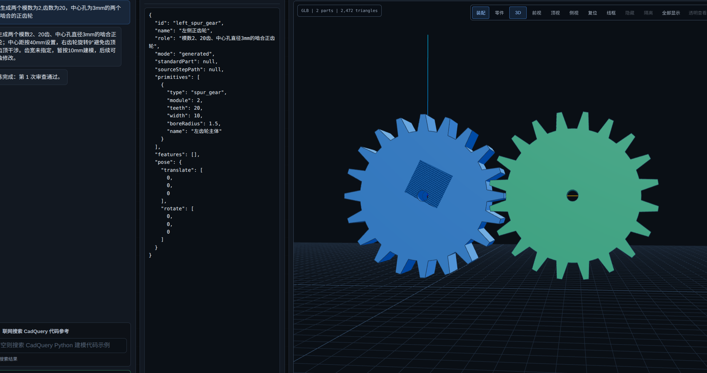
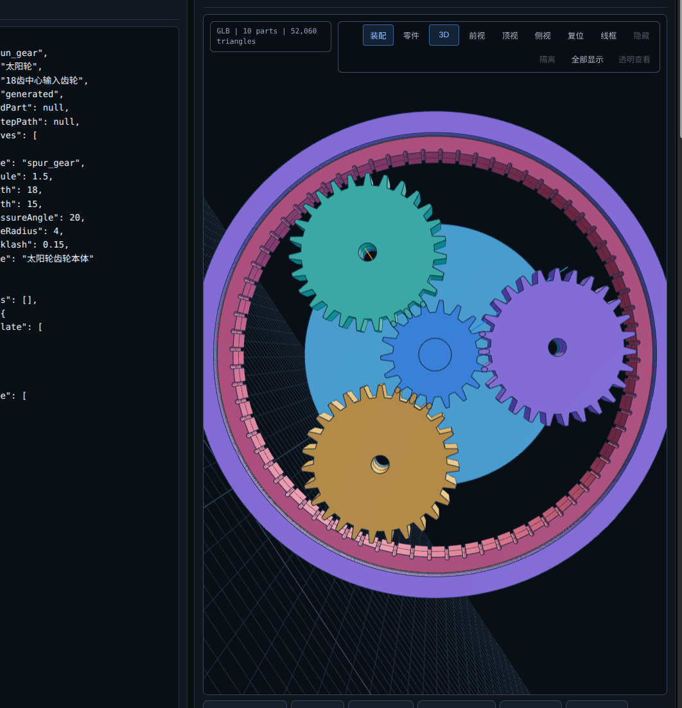
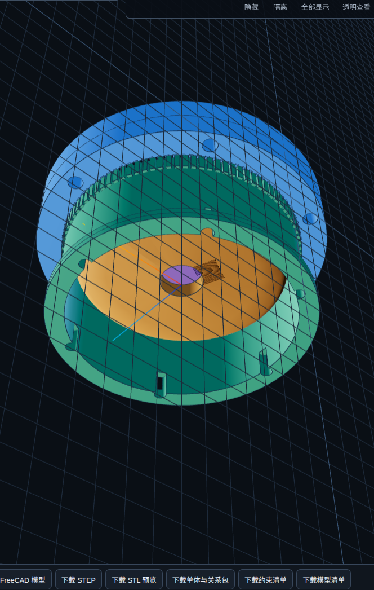

# 工程示例

以下截图来自 AI-CAD 当前研发过程，用于记录参数化几何、装配组织和工程预览能力。截图不是验收报告；模型是否可制造、可装配或满足实际工况，必须以对应修订的 BREP 验证、尺寸报告、材料计算和工程评审为准。

## 渐开线正齿轮啮合

展示两个参数化正齿轮及其啮合位置。界面同时呈现自然语言需求、特征 JSON 和三维结果，适合检查齿数、模数、中心距、齿宽与中心孔等输入是否保持一致。

## 行星减速机

展示太阳轮、行星轮、内齿圈、行星架和外壳等多零件装配。正式验收还应检查齿数关系、目标传动比、同轴度、相位、啮合间隙、干涉和运动约束。

## 谐波减速机

展示谐波减速机概念装配及透明工程查看。该示例主要证明多层结构表达和装配预览能力；柔轮变形、齿形接触、材料疲劳、刚度和传动误差仍需专用仿真与试验验证。

## 使用边界

- 截图中的界面状态与文字属于当次研发记录，可能与后续版本不同；
- 三维预览用于审查，不是几何权威源；
- 参数化计划和成功修订的 STEP/BREP 才是几何交付依据；
- 机械性能结论不得仅凭截图或视觉审查得出。
